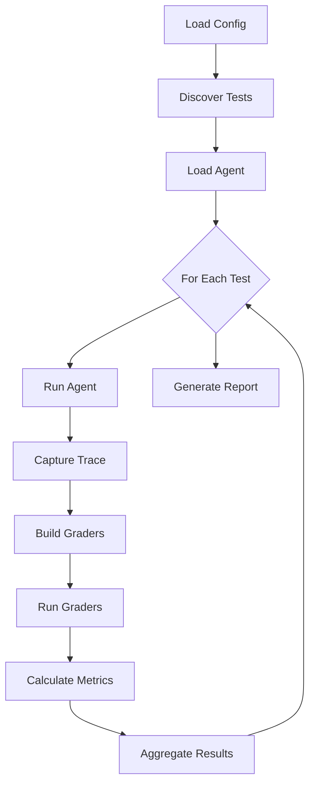

# Evaluation Workflow

This document explains how Evaldeck evaluates an agent from start to finish.

## Overview



## Phase 1: Initialization

### Load Configuration

Evaldeck loads settings from `evaldeck.yaml`:

```yaml
version: 1
agent:
  module: my_agent
  function: run_agent
test_dir: tests/evals
defaults:
  timeout: 30
```

```python
from evaldeck.config import EvaldeckConfig

config = EvaldeckConfig.load()  # Searches for evaldeck.yaml
```

### Discover Tests

Test cases are discovered from the `test_dir`:

```
tests/evals/
├── booking/
│   ├── basic.yaml      → EvalCase
│   └── complex.yaml    → EvalCase
└── search/
    └── web.yaml        → EvalCase
```

```python
from evaldeck import EvalSuite

suite = EvalSuite.from_directory("tests/evals")
print(f"Found {len(suite.cases)} tests")
```

### Load Agent

The agent function is dynamically imported:

```python
import importlib

module = importlib.import_module(config.agent.module)
agent_func = getattr(module, config.agent.function)
```

## Phase 2: Execution

For each test case:

### Run Agent

The agent function is called with the test input:

```python
trace = agent_func(test_case.input)
```

The agent function must return a `Trace`:

```python
def run_agent(input: str) -> Trace:
    trace = Trace(input=input)
    # ... agent logic ...
    trace.complete(output="...")
    return trace
```

### Capture Trace

If using the OpenTelemetry integration:

```python
from evaldeck.integrations import setup_otel_tracing
from openinference.instrumentation.langchain import LangChainInstrumentor

processor = setup_otel_tracing()
LangChainInstrumentor().instrument()

processor.reset()
agent.invoke({"input": test_case.input})
trace = processor.get_latest_trace()
```

## Phase 3: Evaluation

### Build Graders

Graders are built from two sources:

**1. Auto-built from `expected`:**

```yaml
expected:
  tools_called: [search, book]    # → ToolCalledGrader
  output_contains: [confirmed]    # → ContainsGrader
  max_steps: 5                    # → MaxStepsGrader
```

**2. Explicitly defined:**

```yaml
graders:
  - type: llm
    prompt: "Is this helpful?"
```

```python
# Inside Evaluator
def _build_graders(test_case: EvalCase) -> list[BaseGrader]:
    graders = []

    expected = test_case.expected
    if expected:
        if expected.tools_called:
            graders.append(ToolCalledGrader(expected.tools_called))
        if expected.output_contains:
            graders.append(ContainsGrader(expected.output_contains))
        # ... etc

    # Add custom graders
    for config in test_case.graders:
        graders.append(self._build_grader_from_config(config))

    return graders
```

### Run Graders

Each grader evaluates the trace:

```python
results = []
for grader in graders:
    result = grader.grade(trace, test_case)
    results.append(result)
```

Grading is independent—each grader runs regardless of others' results.

### Calculate Metrics

Metrics are calculated from the trace:

```python
metrics = []
for metric in self.metrics:
    result = metric.calculate(trace, test_case)
    metrics.append(result)
```

Built-in metrics:

- Step count
- Token usage
- Duration
- Tool diversity
- Error rate

## Phase 4: Aggregation

### Per-Test Results

```python
eval_result = EvaluationResult(
    test_case=test_case.name,
    trace_id=trace.id,
    grades=grade_results,
    metrics=metric_results,
    duration_ms=...,
)

# Derived properties
eval_result.passed  # True if all grades passed
eval_result.pass_rate  # Fraction of grades that passed
```

### Suite Results

```python
suite_result = SuiteResult(
    name=suite.name,
    results=[eval_result1, eval_result2, ...],
)

# Derived properties
suite_result.total    # Total tests
suite_result.passed   # Passed tests
suite_result.failed   # Failed tests
suite_result.pass_rate  # passed / total
```

### Run Results

```python
run_result = RunResult(
    suite_results=[suite_result1, suite_result2, ...],
)

# Derived properties
run_result.total
run_result.passed
run_result.pass_rate
run_result.all_passed  # True if 100% pass rate
```

## Phase 5: Reporting

### Text Output

```
Running 3 tests...

  ✓ book_flight_basic (1.2s)
  ✓ book_flight_roundtrip (2.1s)
  ✗ book_flight_preferences (1.8s)
    └─ FAIL: ToolCalledGrader
       Expected: ['search', 'set_preferences', 'book']
       Actual: ['search', 'book']

Results: 2/3 passed (66.7%)
```

### JSON Output

```json
{
  "total": 3,
  "passed": 2,
  "failed": 1,
  "pass_rate": 0.667,
  "results": [
    {
      "test_case": "book_flight_basic",
      "status": "PASS",
      "grades": [...],
      "metrics": [...]
    }
  ]
}
```

### JUnit Output

```xml
<testsuites>
  <testsuite name="evaldeck" tests="3" failures="1">
    <testcase name="book_flight_basic" time="1.2"/>
    <testcase name="book_flight_roundtrip" time="2.1"/>
    <testcase name="book_flight_preferences" time="1.8">
      <failure>ToolCalledGrader: Expected tool 'set_preferences'</failure>
    </testcase>
  </testsuite>
</testsuites>
```

## Workflow Customization

### Filter by Tags

```bash
evaldeck run --tag critical
```

```python
# Only run tests with matching tags
filtered = suite.filter_by_tags(["critical"])
```

### Run Specific Suite

```bash
evaldeck run --suite booking
```

### Custom Thresholds

```yaml
thresholds:
  min_pass_rate: 0.9
```

The run fails if pass rate is below threshold.

## Error Handling

### Agent Errors

If the agent raises an exception:

```python
try:
    trace = agent_func(test_case.input)
except Exception as e:
    trace = Trace(
        input=test_case.input,
        output=str(e),
        status=TraceStatus.ERROR
    )
```

### Grader Errors

If a grader fails:

```python
try:
    result = grader.grade(trace, test_case)
except Exception as e:
    result = GradeResult.error_result(
        grader_name=grader.__class__.__name__,
        message=str(e)
    )
```

### Timeout Handling

```python
import signal

def timeout_handler(signum, frame):
    raise TimeoutError()

signal.alarm(test_case.timeout)
try:
    trace = agent_func(test_case.input)
finally:
    signal.alarm(0)
```

## Programmatic Usage

Run evaluations from Python:

```python
from evaldeck import Evaluator, EvalSuite, EvaluationRunner

# Option 1: Evaluate single trace
evaluator = Evaluator()
result = evaluator.evaluate(trace, test_case)

# Option 2: Evaluate suite
suite_result = evaluator.evaluate_suite(suite, agent_func)

# Option 3: Full run with config
runner = EvaluationRunner(config)
run_result = runner.run()
```
