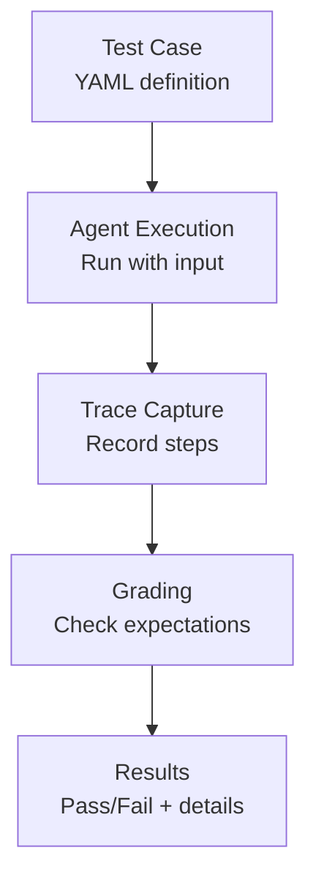

# Your First Evaluation

This guide walks you through a complete evaluation workflow, explaining each component in detail.

## The Evaluation Workflow

Evaldeck follows a straightforward workflow:



Let's explore each step.

## Step 1: Define a Test Case

A test case specifies:

- **Turns**: The conversation (user messages and expected behaviors)
- **Graders**: How to evaluate (optional)

```yaml title="tests/evals/weather_check.yaml"
name: get_weather_forecast
description: Agent should fetch and present weather data

turns:
  - user: "What's the weather like in San Francisco tomorrow?"
    expected:
      # Tool expectations
      tools_called:
        - get_weather
      tools_not_called:
        - book_flight  # Irrelevant for this task

      # Output expectations
      output_contains:
        - "San Francisco"
        - "tomorrow"
      output_not_contains:
        - "error"
        - "unable"

      # Performance expectations
      max_steps: 3
      task_completed: true

tags:
  - weather
  - simple
```

## Step 2: Implement Your Agent

Your agent function receives the input and returns a `Trace`:

```python title="weather_agent.py"
from evaldeck import Trace, Step
import weather_api  # Your weather API client

def run_agent(input: str) -> Trace:
    """Simple weather agent."""
    trace = Trace(input=input)

    # Step 1: Parse the request (LLM call)
    trace.add_step(Step.llm_call(
        model="gpt-4o-mini",
        input=f"Extract location and date from: {input}",
        output='{"location": "San Francisco", "date": "tomorrow"}'
    ))

    # Step 2: Fetch weather data (tool call)
    weather_data = weather_api.get_weather("San Francisco", "tomorrow")
    trace.add_step(Step.tool_call(
        tool_name="get_weather",
        tool_args={"location": "San Francisco", "date": "tomorrow"},
        tool_result=weather_data
    ))

    # Step 3: Format response (LLM call)
    response = f"Tomorrow in San Francisco: {weather_data['summary']}"
    trace.add_step(Step.llm_call(
        model="gpt-4o-mini",
        input=f"Format this weather data: {weather_data}",
        output=response
    ))

    # Complete the trace
    trace.complete(output=response)
    return trace
```

## Step 3: Configure Evaldeck

Point Evaldeck to your agent:

```yaml title="evaldeck.yaml"
version: 1

agent:
  module: weather_agent
  function: run_agent

test_dir: tests/evals

defaults:
  timeout: 30
```

## Step 4: Run the Evaluation

```bash
evaldeck run
```

### Understanding the Output

**Success case:**

```
  ✓ get_weather_forecast (0.5s)
```

The test passed. All expected behaviors were satisfied.

**Failure case:**

```
  ✗ get_weather_forecast (0.4s)
    └─ FAIL: ToolCalledGrader
       Expected tools: ['get_weather']
       Actual tools: ['search_web']
```

The test failed. The agent called `search_web` instead of `get_weather`.

## Step 5: Analyze Results

### Verbose Output

Use `--verbose` for detailed traces:

```bash
evaldeck run --verbose
```

```
  ✗ get_weather_forecast (0.4s)

    Trace:
    ├─ [1] LLM_CALL (gpt-4o-mini)
    │   └─ Extracted: {"location": "San Francisco", "date": "tomorrow"}
    ├─ [2] TOOL_CALL (search_web)        ← Problem here
    │   └─ Args: {"query": "weather San Francisco"}
    └─ [3] LLM_CALL (gpt-4o-mini)
        └─ Generated response

    Grades:
    ├─ ToolCalledGrader: FAIL
    │   Expected: ['get_weather']
    │   Actual: ['search_web']
    └─ ContainsGrader: PASS
```

### JSON Output

For programmatic analysis:

```bash
evaldeck run --output json --output-file results.json
```

```json
{
  "total": 1,
  "passed": 0,
  "failed": 1,
  "pass_rate": 0.0,
  "results": [
    {
      "test_case": "get_weather_forecast",
      "status": "FAIL",
      "grades": [
        {
          "grader": "ToolCalledGrader",
          "status": "FAIL",
          "expected": ["get_weather"],
          "actual": ["search_web"]
        }
      ]
    }
  ]
}
```

## Adding LLM-Based Grading

For subjective evaluation, add an LLM grader:

```yaml title="tests/evals/weather_check.yaml"
name: get_weather_forecast
turns:
  - user: "What's the weather like in San Francisco tomorrow?"
    expected:
      tools_called:
        - get_weather

# Add LLM grading
graders:
  - type: llm
    prompt: |
      Evaluate if this response is helpful and accurate.

      User asked: {{ input }}
      Agent responded: {{ output }}

      Is the response helpful? Answer PASS or FAIL with explanation.
    model: gpt-4o-mini
```

## Best Practices

### 1. Start Simple

Begin with basic tool and output checks:

```yaml
expected:
  tools_called: [required_tool]
  output_contains: ["expected phrase"]
```

### 2. Add Constraints Incrementally

Once basic tests pass, add efficiency constraints:

```yaml
expected:
  tools_called: [required_tool]
  max_steps: 5  # Add after baseline works
```

### 3. Use Tags for Organization

```yaml
tags:
  - critical      # Must pass for deployment
  - weather       # Feature area
  - regression    # Prevent regressions
```

Run specific tags:

```bash
evaldeck run --tag critical
```

### 4. Test Edge Cases

Create separate test cases for edge cases:

```yaml
# Normal case
name: weather_valid_city
turns:
  - user: "Weather in New York"
    expected:
      task_completed: true

---
# Edge case
name: weather_invalid_city
turns:
  - user: "Weather in Atlantis"
    expected:
      output_contains: ["not found", "unknown"]
```

## Next Steps

You've completed your first evaluation! Continue learning:

- **[Test Cases](../user-guide/test-cases.md)** - All test case options
- **[Graders](../user-guide/graders/index.md)** - Deep dive into grading
- **[Traces](../concepts/traces.md)** - Understanding execution traces
