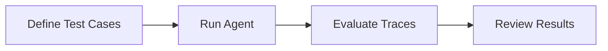

# Getting Started

Welcome to Evaldeck! This section will help you get up and running with agent evaluation.

## What You'll Learn

1. **[Installation](installation.md)** - Install Evaldeck and optional dependencies
2. **[Quick Start](quickstart.md)** - Initialize a project and run your first evaluation
3. **[Your First Evaluation](first-evaluation.md)** - Understand the evaluation workflow in depth

## Prerequisites

- **Python 3.10+** - Evaldeck requires Python 3.10 or later
- **An AI Agent** - Any agent that you want to evaluate (LangChain, CrewAI, custom, etc.)
- **(Optional) API Keys** - For LLM-based grading, you'll need OpenAI or Anthropic API keys

## Quick Overview

Evaldeck works in three simple steps:



### 1. Define Test Cases

Write YAML files describing what your agent should do:

```yaml
name: search_and_book
input: "Find and book a hotel in Paris"
expected:
  tools_called: [search_hotels, book_hotel]
  output_contains: ["confirmation", "Paris"]
  max_steps: 5
```

### 2. Run Evaluations

Execute your test cases with a single command:

```bash
evaldeck run
```

### 3. Review Results

Get clear, actionable feedback:

```
  ✓ search_and_book (1.2s)
  ✗ complex_booking (2.1s)
    └─ FAIL: Expected tool 'filter_results' was not called
```

## Supported Agent Frameworks

Evaldeck uses OpenTelemetry/OpenInference for automatic trace capture and works with:

| Framework | Status | Notes |
|-----------|--------|-------|
| LangChain / LangGraph | ✅ Supported | Via `openinference-instrumentation-langchain` |
| CrewAI | ✅ Supported | Via `openinference-instrumentation-crewai` |
| OpenAI SDK | ✅ Supported | Via `openinference-instrumentation-openai` |
| Anthropic SDK | ✅ Supported | Via `openinference-instrumentation-anthropic` |
| LiteLLM | ✅ Supported | Via `openinference-instrumentation-litellm` |
| Custom Agents | ✅ Supported | Manual trace construction or custom instrumentation |

## Next Steps

Ready to dive in? Start with [Installation](installation.md).
