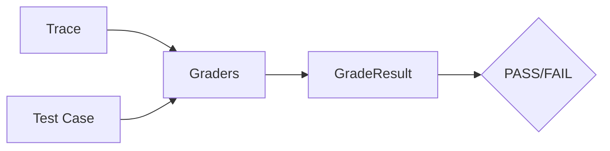

# Graders

Graders evaluate whether an agent's execution meets expectations. Evaldeck provides two types of graders: **code-based** (deterministic) and **LLM-based** (model-as-judge).

## Overview

| Type | Best For | Pros | Cons |
|------|----------|------|------|
| Code-based | Objective checks | Fast, deterministic, free | Limited to rule-based logic |
| LLM-based | Subjective evaluation | Flexible, nuanced | Slower, costs API calls, non-deterministic |

Most evaluations combine both types for comprehensive coverage.

## How Grading Works



Each grader receives:

- **Trace**: The complete execution record
- **Test Case**: The test definition with expectations

And returns a **GradeResult** with:

- **Status**: PASS, FAIL, ERROR, or SKIP
- **Score**: Optional numeric score (0.0-1.0)
- **Message**: Explanation of the result

## Built-in Graders

Evaldeck automatically creates graders from your `expected` block:

```yaml
expected:
  tools_called: [search, book]      # → ToolCalledGrader
  tools_not_called: [delete]        # → ToolNotCalledGrader
  output_contains: ["confirmed"]    # → ContainsGrader
  max_steps: 5                      # → MaxStepsGrader
```

You can also add explicit graders:

```yaml
graders:
  - type: llm
    prompt: "Is this response helpful?"
    model: gpt-4o-mini
```

## Code-Based Graders

Fast, deterministic checks for objective criteria:

- **ContainsGrader** - Output contains expected strings
- **NotContainsGrader** - Output doesn't contain forbidden strings
- **EqualsGrader** - Exact output match
- **RegexGrader** - Regex pattern match
- **ToolCalledGrader** - Required tools were called
- **ToolNotCalledGrader** - Forbidden tools weren't called
- **ToolOrderGrader** - Tools called in correct sequence
- **MaxStepsGrader** - Within step limit
- **TaskCompletedGrader** - Agent completed successfully

[Learn more about code-based graders →](code-based.md)

## LLM-Based Graders

Use an LLM to evaluate subjective criteria:

- **LLMGrader** - Pass/fail based on prompt
- **LLMRubricGrader** - Multi-criteria scoring

```yaml
graders:
  - type: llm
    prompt: |
      Is this response helpful and accurate?
      Response: {{ output }}
      Answer PASS or FAIL.
    model: gpt-4o-mini
```

[Learn more about LLM graders →](llm-based.md)

## Custom Graders

Create your own grading logic:

```yaml
graders:
  - type: code
    module: my_graders
    function: check_format
```

[Learn more about custom graders →](custom.md)

## Combining Graders

### All Must Pass (Default)

By default, all graders must pass:

```yaml
expected:
  tools_called: [search]      # Must pass
  output_contains: [result]   # AND must pass
```

### Composite Graders

For complex logic, use composite graders programmatically:

```python
from evaldeck.graders import CompositeGrader, ContainsGrader, ToolCalledGrader

# All must pass
grader = CompositeGrader(
    graders=[
        ContainsGrader(values=["confirmed"]),
        ToolCalledGrader(required=["book"]),
    ],
    mode="all"  # all must pass
)

# Any can pass
grader = CompositeGrader(
    graders=[
        ContainsGrader(values=["success"]),
        ContainsGrader(values=["completed"]),
    ],
    mode="any"  # at least one must pass
)
```

## Grading Strategy

### Layer Your Evaluation

Start with fast, deterministic checks, then add LLM evaluation:

```yaml
# Layer 1: Quick checks (free, deterministic)
expected:
  tools_called: [required_tool]
  output_not_contains: [error]

# Layer 2: Nuanced evaluation (costs API calls)
graders:
  - type: llm
    prompt: "Is this response professional and helpful?"
```

### Match Grader to Criteria

| Criteria | Grader Type |
|----------|-------------|
| Tool was called | Code (ToolCalledGrader) |
| Output format correct | Code (RegexGrader) |
| Response is helpful | LLM |
| Tone is professional | LLM |
| No errors occurred | Code (NotContainsGrader) |
| Information is accurate | LLM |

## GradeResult

Every grader returns a `GradeResult`:

```python
@dataclass
class GradeResult:
    grader_name: str           # Name of the grader
    status: GradeStatus        # PASS, FAIL, ERROR, SKIP
    score: float | None        # Optional 0.0-1.0 score
    message: str               # Explanation
    details: dict | None       # Additional data
    expected: Any | None       # What was expected
    actual: Any | None         # What was observed
```

Example output:

```
ToolCalledGrader: FAIL
  Expected: ['search', 'book']
  Actual: ['search']
  Missing: ['book']
```
