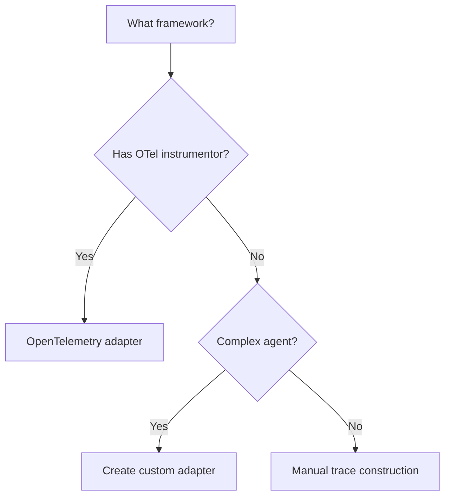

# Framework Integrations

Evaldeck works with any agent framework by capturing execution as a `Trace`. This guide covers integration options.

## Overview

| Framework | Integration Method | Status |
|-----------|-------------------|--------|
| LangChain / LangGraph | Built-in | Available |
| CrewAI | OpenTelemetry | Available |
| LiteLLM | OpenTelemetry | Available |
| OpenAI SDK | OpenTelemetry | Available |
| Anthropic SDK | OpenTelemetry | Available |
| AutoGen | OpenTelemetry | Available |
| Custom agents | Manual trace construction | Supported |

## Integration Approaches

### 1. Built-in Framework Integration (Recommended)

For supported frameworks, just set `framework` in your config:

```yaml
# evaldeck.yaml
agent:
  module: my_agent
  function: create_agent
  framework: langchain
```

```python
# my_agent.py
from langchain_openai import ChatOpenAI
from langgraph.prebuilt import create_react_agent

def create_agent():
    llm = ChatOpenAI(model="gpt-4o-mini")
    return create_react_agent(llm, tools=[...])
```

```bash
evaldeck run
```

That's it. Evaldeck handles OTel instrumentation automatically.

**Install:**
```bash
pip install "evaldeck[langchain]"
```

**Note on parallel execution:** Agent invocations are serialized (one at a time) to ensure clean trace capture. Grading still runs in parallel. This is a limitation of OpenTelemetry's global tracer - concurrent agent runs would mix traces.

### 2. OpenTelemetry/OpenInference (Manual Setup)

For frameworks without built-in support, use the OTel adapter directly:

```python
from openinference.instrumentation.crewai import CrewAIInstrumentor
from evaldeck.integrations import setup_otel_tracing

# Setup once
processor = setup_otel_tracing()
CrewAIInstrumentor().instrument()

# Run your agent
result = agent.run("Book a flight")

# Get trace and evaluate
trace = processor.get_latest_trace()
result = evaluator.evaluate(trace, test_case)
```

**Install:**
```bash
pip install evaldeck
pip install openinference-instrumentation-crewai  # or your framework
```

[OpenTelemetry Integration →](opentelemetry.md)

### 2. Manual Trace Construction

For frameworks without OTel support, construct traces manually:

```python
from evaldeck import Trace, Step

trace = Trace(input=user_input)
trace.add_step(Step.tool_call("search", args, result))
trace.complete(output=response)
```

[Manual Traces →](manual.md)

### 3. Custom Adapter

Create your own adapter for unsupported frameworks:

```python
class MyFrameworkTracer:
    def __init__(self):
        self.trace = None

    def on_agent_start(self, input):
        self.trace = Trace(input=input)

    def on_tool_call(self, name, args, result):
        self.trace.add_step(Step.tool_call(name, args, result))

    def on_agent_end(self, output):
        self.trace.complete(output=output)

    def get_trace(self):
        return self.trace
```

## Which Approach to Use?



**Quick decision:**
- **LangChain, CrewAI, OpenAI, etc.?** → OpenTelemetry adapter
- **Custom framework?** → Manual traces or custom adapter

## Common Integration Patterns

### Wrap Existing Agent

```python
from evaldeck import Trace, Step

def evaluate_agent(agent, input: str) -> Trace:
    """Wrap any agent to produce a trace."""
    trace = Trace(input=input)

    # Hook into agent's execution
    original_call_tool = agent.call_tool

    def traced_call_tool(name, args):
        result = original_call_tool(name, args)
        trace.add_step(Step.tool_call(name, args, result))
        return result

    agent.call_tool = traced_call_tool

    # Run agent
    try:
        output = agent.run(input)
        trace.complete(output=output)
    except Exception as e:
        trace.complete(output=str(e), status="error")

    return trace
```

### Decorator Pattern

```python
from functools import wraps
from evaldeck import Trace, Step

def traced(func):
    """Decorator to capture function as trace step."""
    @wraps(func)
    def wrapper(*args, **kwargs):
        trace = get_current_trace()  # Thread-local or context var
        start = time.time()

        try:
            result = func(*args, **kwargs)
            trace.add_step(Step.tool_call(
                tool_name=func.__name__,
                tool_args={"args": args, "kwargs": kwargs},
                tool_result=result,
                duration_ms=(time.time() - start) * 1000
            ))
            return result
        except Exception as e:
            trace.add_step(Step.tool_call(
                tool_name=func.__name__,
                tool_args={"args": args, "kwargs": kwargs},
                tool_result=None,
                error=str(e),
                status="error"
            ))
            raise

    return wrapper
```

### Context Manager Pattern

```python
from contextlib import contextmanager
from evaldeck import Trace

@contextmanager
def trace_context(input: str):
    """Context manager for tracing."""
    trace = Trace(input=input)
    try:
        yield trace
        trace.complete(output=trace.output or "completed")
    except Exception as e:
        trace.complete(output=str(e), status="error")
        raise

# Usage
with trace_context("user query") as trace:
    # Agent execution here
    trace.add_step(...)
    trace.output = "final response"
```

## Testing Your Integration

Verify your integration captures all necessary data:

```python
def test_trace_capture():
    # Run agent
    trace = my_integration.run_and_trace("Book a flight")

    # Verify trace structure
    assert trace.input == "Book a flight"
    assert trace.output is not None
    assert trace.status == "success"

    # Verify steps captured
    assert len(trace.steps) > 0

    # Verify tool calls
    tool_names = [s.tool_name for s in trace.tool_calls]
    assert "search_flights" in tool_names

    # Verify can evaluate
    evaluator = Evaluator()
    result = evaluator.evaluate(trace, test_case)
    assert result.passed
```

## Next Steps

- [OpenTelemetry Integration](opentelemetry.md) - Broad framework coverage with OTel
- [Manual Traces](manual.md) - Building traces programmatically
